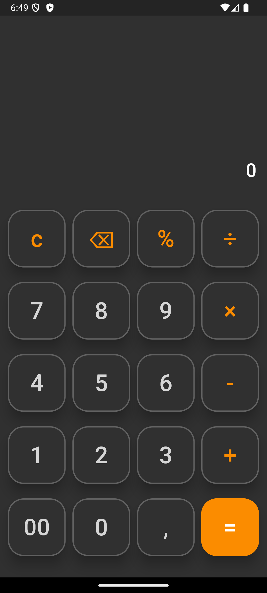
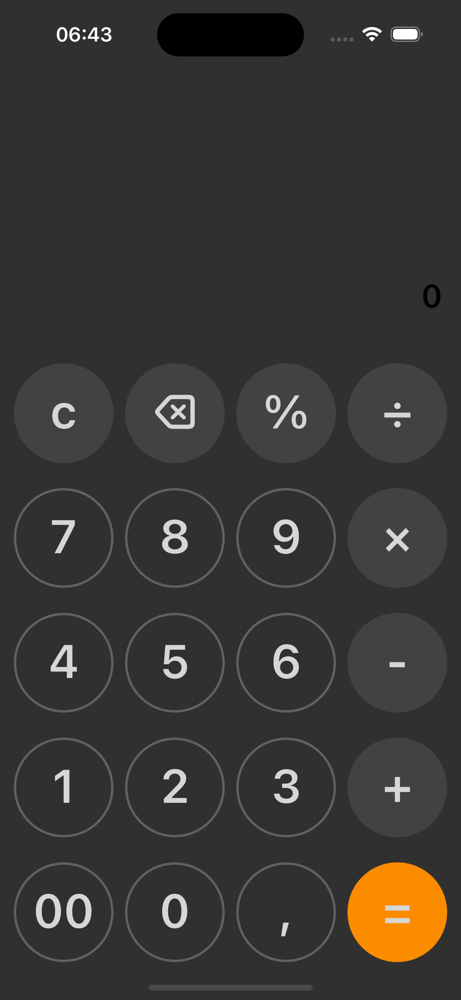

<h1 align="center">Flutter Calculator - MVC, MVVM, and MVI Architectures</h1>

  <strong>🇧🇷 Português</strong>

<h2>✨ Sobre o Projeto</h2>

Este repositório foi criado para demonstrar como diferentes arquiteturas de software podem ser aplicadas a uma mesma aplicação, explorando suas diferenças, vantagens e desafios. As arquiteturas abordadas são MVC (Model-View-Controller), MVVM (Model-View-ViewModel) e MVI (Model-View-Intent).

O objetivo é oferecer um estudo comparativo e prático, aplicando boas práticas e seguindo princípios e boas práticas de desenvolvimento. O código foi estruturado para ser claro, organizado e de fácil entendimento, tornando este projeto uma ótima referência para estudos e portfólio.

 
<h2>📚 Estudo de Caso</h2>

Para este estudo, escolhemos implementar uma calculadora, pois é uma aplicação:

<ul>
  <li><strong>Simples de entender</strong> → Possui uma UI minimalista e uma lógica direta.</li>
  <li><strong>Comum em testes técnicos</strong> → Muitas entrevistas utilizam pequenos desafios como esse para avaliar boas práticas.</li>
  <li><strong>Ótima para demonstrar padrões arquiteturais</strong> → Apesar de simples, envolve separação de responsabilidades, reatividade da interface e processamento de dados.
</li>
</ul>

A ideia é mostrar como cada arquitetura estrutura a mesma lógica, identificando os impactos na organização do código, manutenção e escalabilidade.

 
<h2>📌 Comparação Entre as Arquiteturas</h2>

  <table>
    <thead>
      <tr>
        <th align="center">Arquitetura</th>
        <th align="center">Complexidade</th>
        <th align="center">Separação de Responsabilidades</th>
        <th align="center">Testabilidade</th>
        <th align="center">Manutenção</th>
      </tr>
    </thead>
    <tbody>
      <tr>
        <th align="center">MVC</th>
        <th align="center">Baixa a moderada. Divisão clássica em três componentes, mas pode levar a controllers sobrecarregados.</th>
        <th align="center">Boa, mas se não for bem estruturado, o Controller pode se tornar um "God Object" (acumula muitas responsabilidades).</th>
        <th align="center">Moderada. O Controller pode ser difícil de testar devido ao acoplamento com a View.</th>
        <th align="center">Moderada. Pode se tornar difícil de manter em projetos grandes devido ao acoplamento entre View e Controller.</th>
      </tr>
      <tr>
        <th align="center">MVVM</th>
        <th align="center">Moderada a alta. Introduz o ViewModel, que adiciona uma camada de abstração.</th>
        <th align="center">Excelente. O ViewModel isola a lógica de negócios da View, promovendo maior separação.</th>
        <th align="center">Alta. O ViewModel é facilmente testável, pois não depende da View.</th>
        <th align="center">Alta. A separação clara entre View e ViewModel facilita a manutenção.</th>
      </tr>
      <tr>
        <th align="center">MVI</th>
        <th align="center">Alta. Fluxo unidirecional e imutabilidade aumentam a complexidade inicial.</th>
        <th align="center">Excelente. Fluxo unidirecional e imutabilidade garantem responsabilidades bem definidas.</th>
        <th align="center">Alta. A imutabilidade e o fluxo unidirecional facilitam testes previsíveis.</th>
        <th align="center">Alta. O fluxo unidirecional e a imutabilidade tornam o código mais previsível e fácil de manter.</th>
      </tr>
    </tbody>
  </table>

 
<h3>Considerações</h3>
<ul>
  <li><strong>MVC</strong></li>
  <ul>
    <li><strong>Vantagens</strong>: Simples de implementar.</li>
    <li><strong>Desvantagens</strong>: O Controller pode se tornar complexo e difícil de testar.</li>
  </ul>

  <li><strong>MVVM</strong></li>
  <ul>
    <li><strong>Vantagens</strong>: Separação clara de responsabilidades e alta testabilidade.</li>
    <li><strong>Desvantagens</strong>: Pode introduzir complexidade adicional.</li>
  </ul>

  <li><strong>MVI</strong></li>
  <ul>
    <li><strong>Vantagens</strong>: Previsibilidade e imutabilidade facilitam a depuração e o teste.</li>
    <li><strong>Desvantagens</strong>: Curva de aprendizado mais íngreme e maior complexidade inicial.</li>
  </ul>
</ul>

 
<h2>🛠️ Tecnologias Utilizadas</h2>

Este projeto foi desenvolvido utilizando as seguintes tecnologias e ferramentas:

<ul>
  <li><strong>Flutter</strong>: Framework para desenvolvimento mobile com foco em performance e interface de usuário (UI) fluida.</li>
  <li><strong>Dart</strong>: Linguagem de programação base do Flutter, moderna e otimizada para aplicações mobile.</li>
  <li><strong>Arquiteturas MVC, MVVM, e MVI</strong>: Padrões arquiteturais amplamente utilizados, implementados para garantir a separação de responsabilidades, modularidade e escalabilidade no código.</li>
  <li><strong>Git</strong>: Controle de versão para gerenciar e versionar o código-fonte de forma eficiente.</li>
  <li><strong>GitHub</strong>: Plataforma para hospedagem do código-fonte, facilitando a colaboração e o controle do projeto.</li>
</ul>

 
<h2>🏗️ Estrutura e Arquiteturas</h2>

Este projeto está organizado da seguinte forma, com cada arquitetura isolada em seu próprio diretório para facilitar a navegação:

 

  <table>
    <thead>
      <tr>
        <th align="center">Diretório</th>
        <th align="center">Arquitetura</th>
        <th align="center">Descrição</th>
      </tr>
    </thead>
    <tbody>
      <tr>
        <td align="center">calculator_mvc</td>
        <td align="center">MVC</td>
        <td align="center">Implementação do padrão arquitetural MVC (Model-View-Controller). A lógica de apresentação e o controle de dados são separados de forma clara, com cada responsabilidade isolada em sua camada.</td>
      </tr>
      <tr>
        <td align="center">calculator_mvvm</td>
        <td align="center">MVVM</td>
        <td align="center">Implementação do padrão arquitetural MVVM (Model-View-ViewModel). A comunicação entre o modelo e a interface de usuário é feita através do ViewModel, permitindo maior desacoplamento e facilitando testes e manutenção.</td>
      </tr>
      <tr>
        <td align="center">calculator_mvi</td>
        <td align="center"">MVI</td>
        <td align="center"">Implementação do padrão arquitetural MVI (Model-View-Intent). A interação entre a UI e o modelo é simplificada por meio de intents e estados, promovendo maior previsibilidade e controle de fluxo.</td>
      </tr>
    </tbody>
  </table>

 

Cada diretório contém:

<ul>
    <li>Código-fonte da calculadora.</li>
    <li>Documentação detalhada sobre a arquitetura.</li>
    <li>Explicações sobre como as responsabilidades estão distribuídas.</li>
</ul>

Dentro de cada diretório, a estrutura do código segue boas práticas de organização e clareza. Cada arquitetura possui suas particularidades, como organização de pastas e separação de responsabilidades, com os diretórios principais organizados da seguinte forma:

<ul>
    <li><strong>lib</strong>: Código-fonte do projeto, incluindo a implementação de cada arquitetura.</li>
    <li><strong>assets</strong>: Arquivos de recursos, como imagens</li>
</ul>

 
<h3>Decisões Técnicas Comuns às Arquiteturas</h3>

Independentemente da arquitetura utilizada (MVC, MVVM ou MVI), algumas decisões foram aplicadas de maneira padrão para garantir organização, reutilização de código e boas práticas:

<ul>
  <li>Uso de uma camada Repository como única fonte de entrada dos dados</li>
  <ul><li>A Repository gerencia as configurações e comportamentos dos botões da calculadora, garantindo um ponto centralizado.</li></ul>
  <li>Separação das Views por plataforma (Android e iOS)</li>
  <ul><li>Foram criados arquivos distintos para cada sistema operacional, mantendo a mesma lógica compartilhada, reforçando o desacoplamento entre UI e lógica de negócios.</li></ul>
  <li>Boas práticas e padrões</li>
  <ul><li>Embora o foco seja o estudo das arquiteturas, foram seguidos princípios como modularidade, organização de código e separação de responsabilidades, tornando o código mais profissional e legível.</li></ul>
</ul>

 
<h2>🚀 Como Explorar e Executar o Projeto</h2>

Este projeto foi desenvolvido para ser simples de explorar e executar. Para começar, siga as instruções abaixo:

<h3>Pré-requisitos</h3>

Antes de executar o projeto, você precisará garantir que o ambiente esteja preparado com os seguintes requisitos:

<ul>
  <li><strong>Flutter</strong>: Certifique-se de que o Flutter está instalado corretamente. Caso não tenha o Flutter instalado, consulte a documentação oficial para obter instruções: <a href="https://flutter.dev/docs/get-started/install">Instalar Flutter</a>.</li>
  <li><strong>Editor de código</strong>: Recomendamos o uso do Visual Studio Code ou Android Studio, com o plugin Flutter instalado.</li>
</ul>

<h4>Passos para Exploração e Execução</h4>
<ol>
  <li><strong>Clone o repositório</strong>: Para clonar o repositório em seu ambiente local, execute o seguinte comando:
    <pre><code>git clone https://github.com/SEU_USUARIO/flutter_calculator_architectures.git</code></pre>
  </li>
  <li><strong>Instale as dependências</strong>: Navegue até o diretório da arquitetura que deseja explorar (calculator_mvc, calculator_mvvm ou calculator_mvi) e instale as dependências para essa arquitetura usando o comando:
    <pre><code>flutter pub get</code></pre>
  </li>
  <li><strong>Execute o projeto</strong>: Após escolher uma arquitetura e instalar as dependências execute o projeto com o comando:
    <pre><code>flutter run</code></pre>
  </li>
  <li><strong>Explore e altere o código</strong>: Cada diretório contém uma implementação isolada, com uma documentação detalhada sobre como as responsabilidades estão distribuídas. Navegue pelos arquivos de código e veja como as arquiteturas são aplicadas na prática.</li>
</ol>

 
<h2>📱 Demonstração</h2>
 

  
&nbsp;&nbsp;&nbsp;&nbsp;&nbsp;&nbsp;&nbsp;&nbsp;&nbsp;&nbsp;&nbsp;&nbsp;&nbsp;&nbsp;&nbsp;&nbsp;&nbsp;&nbsp;&nbsp;&nbsp;&nbsp;&nbsp;&nbsp;&nbsp;&nbsp;&nbsp;&nbsp;&nbsp;&nbsp;&nbsp;&nbsp;&nbsp;&nbsp;&nbsp;&nbsp;&nbsp;&nbsp;&nbsp;&nbsp;&nbsp;&nbsp;&nbsp;&nbsp;&nbsp;&nbsp;&nbsp;&nbsp;&nbsp;&nbsp;&nbsp;&nbsp;&nbsp;
  

  <strong>Android UI</strong> &nbsp;&nbsp;&nbsp;&nbsp;&nbsp;&nbsp;&nbsp;&nbsp;&nbsp;&nbsp;&nbsp;&nbsp;&nbsp;&nbsp;&nbsp;&nbsp;&nbsp;&nbsp;&nbsp;&nbsp;&nbsp;&nbsp;&nbsp;&nbsp;&nbsp;&nbsp;&nbsp;&nbsp;&nbsp;&nbsp;&nbsp;&nbsp;&nbsp;&nbsp;&nbsp;&nbsp;&nbsp;&nbsp;&nbsp;&nbsp;&nbsp;&nbsp;&nbsp;&nbsp;&nbsp;&nbsp;&nbsp;&nbsp;&nbsp;&nbsp;&nbsp;&nbsp;&nbsp;&nbsp;&nbsp;&nbsp;&nbsp;&nbsp;&nbsp;&nbsp;&nbsp;&nbsp;&nbsp;&nbsp;&nbsp;&nbsp;&nbsp;&nbsp;&nbsp;&nbsp;&nbsp;&nbsp;&nbsp;&nbsp;&nbsp;&nbsp;&nbsp;&nbsp;&nbsp;&nbsp;&nbsp;&nbsp;&nbsp;&nbsp;&nbsp;&nbsp;&nbsp;&nbsp;&nbsp;&nbsp;&nbsp;&nbsp;&nbsp;&nbsp;&nbsp;&nbsp;&nbsp;&nbsp;&nbsp;&nbsp;&nbsp;&nbsp;&nbsp;&nbsp;&nbsp;&nbsp;&nbsp;&nbsp;&nbsp;&nbsp;&nbsp;&nbsp; <strong>iOS UI</strong>

 
<h2>📜 Licença</h2>

  Este projeto está licenciado sob a licença <a href="https://opensource.org/licenses/MIT" target="_blank"><strong>MIT</strong></a>. Isso significa que você tem a liberdade de usar, modificar e distribuir este projeto, desde que atribua os créditos apropriados e mantenha a mesma licença em trabalhos derivados.

 
<h2>📬 Entre em Contato</h2>

  Ficarei feliz em receber feedbacks, esclarecer dúvidas, me conectar ou apenas bater um papo. Fique à vontade para entrar em contato:

<ul>
  <li><strong>E-mail:</strong> <a href="mailto:herminio.rocha@outlook.com.br">herminio.rocha@outlook.com.br</a></li>
  <li><strong>LinkedIn:</strong> <a href="https://www.linkedin.com/in/herminio-rocha-9325a2137" target="_blank">Herminio Rocha</a></li>
</ul>

 
<h2></h2>

<em>Este projeto foi desenvolvido com o objetivo de explorar e estudar diferentes arquiteturas, aplicando seus conceitos e princípios, seguindo boas práticas e padrões utilizando Flutter. </em>

<em>Obrigado por visitar este projeto! Espero que seja útil para você e inspire novos aprendizados.</em>

<em>Jesus abençoe a todos 🙏</em>

<h2></h2>
 

  <strong>🇺🇸 English</strong>

<h2>✨ About the Project</h2>

This repository was created to demonstrate how different software architectures can be applied to the same application, exploring their differences, advantages, and challenges. The architectures covered are MVC (Model-View-Controller), MVVM (Model-View-ViewModel), and MVI (Model-View-Intent).

The goal is to offer a comparative and practical study, applying best practices and development principles. The code is structured to be clear, organized, and easy to understand, making this project a great reference for learning and portfolio.

 
<h2>📚 Case Study</h2>

For this study, we chose to implement a calculator because it is an application that:

<ul>
  <li><strong>Easy to understand</strong> → Has a minimalist UI and straightforward logic.</li>
  <li><strong>Common in technical tests</strong> → Many interviews use small challenges like this to evaluate best practices.</li>
  <li><strong>Great for demonstrating architectural patterns</strong> → Despite being simple, it involves separation of concerns, UI reactivity, and data processing.</li>
</ul>

The idea is to show how each architecture structures the same logic, identifying impacts on code organization, maintenance, and scalability.

 
<h2>📌 Comparison Between Architectures</h2>

  <table>
    <thead>
      <tr>
        <th align="center">Architecture</th>
        <th align="center">Complexity</th>
        <th align="center">Separation of Concerns</th>
        <th align="center">Testability</th>
        <th align="center">Maintainability</th>
      </tr>
    </thead>
    <tbody>
      <tr>
        <th align="center">MVC</th>
        <th align="center">Low to moderate. Classical division into three components, but controllers can become overloaded.</th>
        <th align="center">Good, but if not well-structured, the Controller can become a "God Object" (accumulates too many responsibilities).</th>
        <th align="center">Moderate. The Controller can be difficult to test due to its coupling with the View.</th>
        <th align="center">Moderate. Can become hard to maintain in large projects due to View-Controller coupling.</th>
      </tr>
      <tr>
        <th align="center">MVVM</th>
        <th align="center">Moderate to high. Introduces the ViewModel, adding an abstraction layer.</th>
        <th align="center">Excellent. The ViewModel isolates business logic from the View, promoting better separation.</th>
        <th align="center">High. The ViewModel is easily testable since it does not depend on the View.</th>
        <th align="center">High. Clear separation between View and ViewModel facilitates maintenance.</th>
      </tr>
      <tr>
        <th align="center">MVI</th>
        <th align="center">High. Unidirectional data flow and immutability increase initial complexity.</th>
        <th align="center">EExcellent. Unidirectional flow and immutability ensure well-defined responsibilities.</th>
        <th align="center">High. Immutability and unidirectional flow make tests more predictable.</th>
        <th align="center">High. The unidirectional flow and immutability make the code more predictable and easier to maintain.</th>
      </tr>
    </tbody>
  </table>

 
<h3>Considerations</h3>
<ul>
  <li><strong>MVC</strong></li>
  <ul>
    <li><strong>Advantages</strong>: Simple to implement.</li>
    <li><strong>Disadvantages</strong>: The Controller can become complex and hard to test.</li>
  </ul>

  <li><strong>MVVM</strong></li>
  <ul>
    <li><strong>Advantages</strong>: Clear separation of concerns and high testability.</li>
    <li><strong>Disadvantages</strong>: Can introduce additional complexity.</li>
  </ul>

  <li><strong>MVI</strong></li>
  <ul>
    <li><strong>Advantages</strong>: Predictability and immutability make debugging and testing easier.</li>
    <li><strong>Disadvantages</strong>: Steeper learning curve and higher initial complexity.</li>
  </ul>
</ul>

 
<h2>🛠️ Technologies Used</h2>

This project was developed using the following technologies and tools:

<ul>
  <li><strong>Flutter</strong>: A mobile development framework focused on performance and smooth user interfaces (UI).</li>
  <li><strong>Dart</strong>: The programming language used by Flutter, modern and optimized for mobile applications.</li>
  <li><strong>Architectures MVC, MVVM, and MVI</strong>: Widely used architectural patterns implemented to ensure separation of concerns, modularity, and scalability in the code.</li>
  <li><strong>Git</strong>: Version control system to manage and track the source code efficiently.</li>
  <li><strong>GitHub</strong>: Platform for hosting the source code, enabling collaboration and project management.</li>
</ul>

 
<h2>🏗️ Project Structure & Architectures</h2>

This project is organized into different directories, each containing an isolated implementation for easy navigation:

 

  <table>
    <thead>
      <tr>
        <th align="center">Directory</th>
        <th align="center">Architecture</th>
        <th align="center">Description</th>
      </tr>
    </thead>
    <tbody>
      <tr>
        <td align="center">calculator_mvc</td>
        <td align="center">MVC</td>
        <td align="center">Implementation of Model-View-Controller. Presentation logic and data control are clearly separated, with each responsibility isolated into its respective layer.</td>
      </tr>
      <tr>
        <td align="center">calculator_mvvm</td>
        <td align="center">MVVM</td>
        <td align="center">Implementation of Model-View-ViewModel. Communication between the model and the user interface is done through the ViewModel, allowing greater decoupling and easier testing and maintenance.</td>
      </tr>
      <tr>
        <td align="center">calculator_mvi</td>
        <td align="center"">MVI</td>
        <td align="center"">Implementation of Model-View-Intent. The interaction between the UI and the model is simplified through intents and states, promoting greater predictability and flow control.</td>
      </tr>
    </tbody>
  </table>

 

Each directory contains:

<ul>
    <li>Calculator source code.</li>
    <li>Detailed documentation on the architecture.</li>
    <li>Explanations on how responsibilities are distributed.</li>
</ul>

Within each directory, the code structure follows best practices for clarity and organization.
Each architecture has its own characteristics, such as folder organization and separation of concerns, with the main directories structured as follows:

<ul>
    <li><strong>lib</strong>: The project's source code, including the implementation of each architecture.</li>
    <li><strong>assets</strong>: Resource files, such as images and icons.</li>
</ul>

 
<h3>Common Technical Decisions Across Architectures</h3>

Regardless of the chosen architecture (MVC, MVVM, or MVI), some design decisions were applied consistently to ensure organization, code reusability, and best practices:

<ul>
  <li>Use of a Repository Layer as the Single Source of Truth</li>
  <ul><li>The Repository manages the calculator button configurations and behaviors, providing a centralized access point for data management.</li></ul>
  <li>Separation of Views by Platform (Android & iOS)</li>
  <ul><li>Dedicated files were created for each operating system while maintaining shared logic, reinforcing the decoupling between UI and business logic.</li></ul>
  <li>Best Practices & Development Standards</li>
  <ul><li>Although the primary focus is on studying architectures, principles such as modularity, code organization, and separation of concerns were followed, ensuring a more professional and readable codebase.</li></ul>
</ul>

 
<h2>🚀 How to Explore and Run the Project</h2>

This project has been designed to be simple to explore and run. Follow the instructions below to get started:

<h3>Prerequisites</h3>

Before running the project, ensure your development environment is set up with the following requirements:

<ul>
  <li><strong>Flutter</strong>: Make sure Flutter is correctly installed. If you don’t have Flutter installed, refer to the official documentation for instructions: <a href="https://flutter.dev/docs/get-started/install">Install Flutter</a>.</li>
  <li><strong>Code Editor</strong>: We recommend using Visual Studio Code or Android Studio with the Flutter plugin installed.</li>
</ul>

<h4>Steps to Explore and Run</h4>
<ol>
  <li><strong>Clone the repository</strong>: To clone the repository to your local environment, execute the following command:
    <pre><code>git clone https://github.com/YOUR_USERNAME/flutter_calculator_architectures.git</code></pre>
  </li>
  <li><strong>Install dependencies</strong>: Navigate to the directory of the architecture you wish to explore (calculator_mvc, calculator_mvvm, or calculator_mvi) and install the dependencies for that architecture using the following command:
    <pre><code>flutter pub get</code></pre>
  </li>
  <li><strong>Run the project</strong>: After selecting an architecture and installing the dependencies, run the project using the command:
    <pre><code>flutter run</code></pre>
  </li>
  <li><strong>Explore and modify the code</strong>: Each directory contains an isolated implementation with detailed documentation about how responsibilities are distributed. Browse through the code files to see how the architectures are applied in practice.</li>
</ol>

<h2>📜 License</h2>

This project is licensed under the <a href="https://opensource.org/licenses/MIT" target="_blank"><strong>MIT License.</strong></a> This means you are free to use, modify, and distribute this project as long as you provide appropriate credit and retain the same license for derivative works.

<h2>📬 Get in Touch</h2>

  I’d love to receive feedback, answer questions, connect, or just have a chat. Feel free to reach out:

<ul>
  <li><strong>E-mail:</strong> <a href="mailto:herminio.rocha@outlook.com.br">herminio.rocha@outlook.com.br</a></li>
  <li><strong>LinkedIn:</strong> <a href="https://www.linkedin.com/in/herminio-rocha-9325a2137" target="_blank">Herminio Rocha</a></li>
</ul>

 
<h2></h2>

<em>This project was developed with the goal of exploring and studying different architectures, applying their concepts and principles, and following best practices and software development standards using Flutter.</em>

<em>Thank you for visiting this project! I hope it’s helpful to you and inspires further learning.</em>

<em>May Jesus bless you all 🙏</em>

<h2></h2>
 
